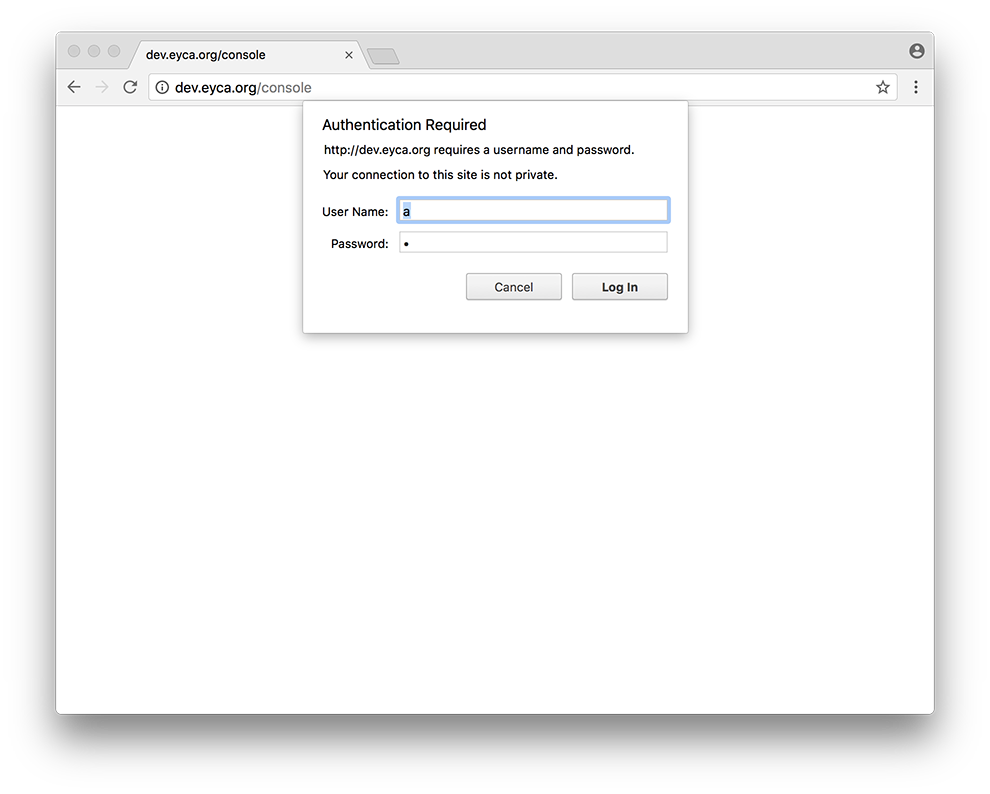
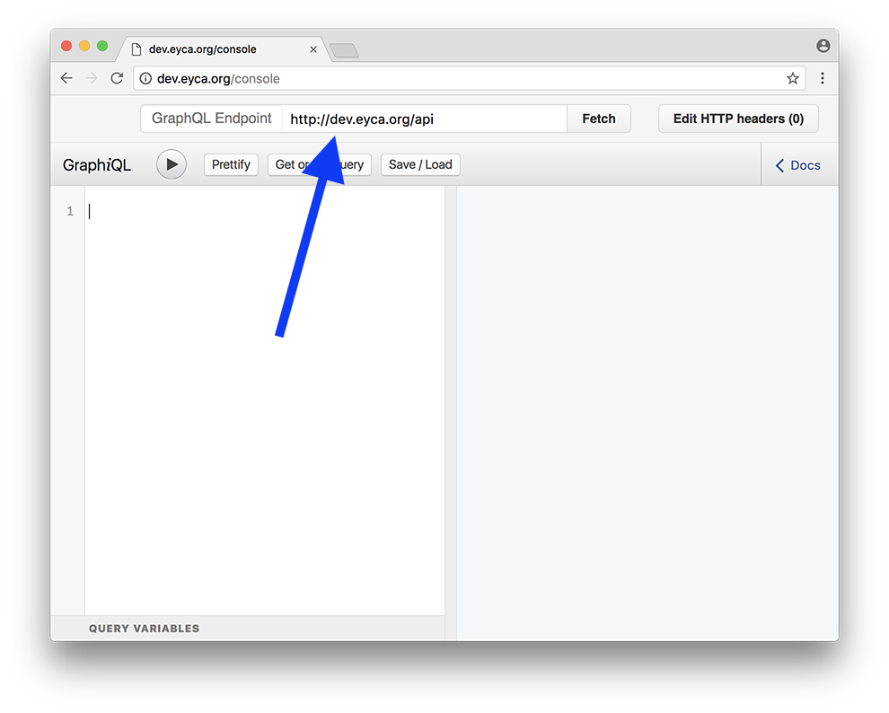
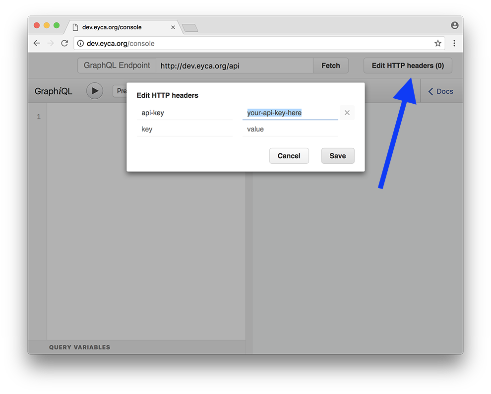
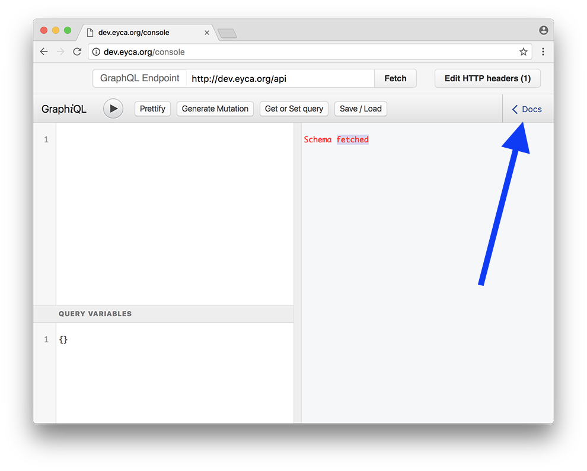
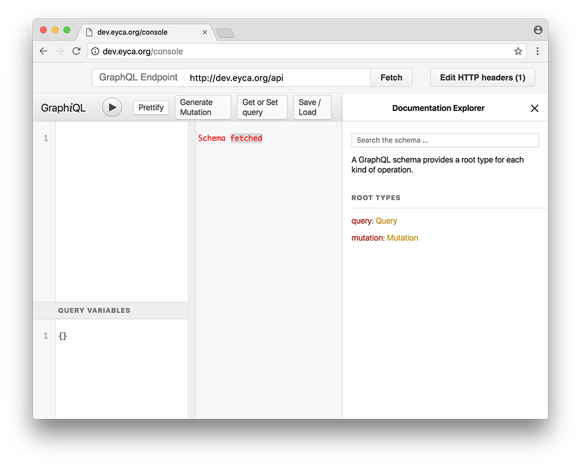

# Introduction

The EYCA API is build on GraphQL protocol (http://graphql.org/).

## Base URL

```
http://dev.eyca.org/api
```

The current url is currently used for development purposes and will be changed when the new website will be going live.

## Authentication

You will need an API Key to connect to the API.

_**Warning**: Keep your API key secret!_

## Example Query

To execute a simple query `{ hello }`.

```sh
curl -X POST \
-H "Content-Type: application/json" \
-H "Api-Key: [your-api-key]" \
-d '{"query": "{ hello }"}' \
http://dev.eyca.org/api
```

Replace `[your-api-key]` with a valid key.

You should get result:

```json
{"data":{"hello":"Hello World"}}
```

# Console

You can use GUI, located at http://dev.eyca.org/console to perform your queries and browse the GraphQL autogenerated documentation.

## Configuring Console

1. Login to console via http basic auth with login `a` and password `b`.

<div align="center"></div>

2. Set up API endpoint as `http://dev.eyca.org/api`.

<div align="center"></div>

3. Edit HTTP Headers and insert your `Api-Key`.

<div align="center"></div>

4. Hit `Fetch` button to fetch the GraphQL schema.

## Autogenerated Documentation

When you have fetched the schema info you can browse autogenerated documentation for possible queries and mutations available.

<div align="center"></div>
<div align="center"></div>

# Basics

Query for info about your account.

```graphql
{
  me {
    id
    name
    email
    member {
      id
      name
      email
      country {
        id name region
      }
      discounts {
        count
      }
    }
    apikey
  }
}
```

# Mutations

Mutations are used to manipulate data on the server.

## Creating Discount

```graphql
mutation createDiscountMutation($data: DiscountInput!) {
  createDiscount(data: $data) {
    id
    created
  }
}
```

```json
{
  "data": {
    "name": "50% Discount",
    "vendor": "Company Name",
    "text": "Some info.",
    "categories": [ "GO" ]
  }
}
```

Expected result:

```json
{
  "data": {
    "createDiscount": {
      "id": "594faf8e4e8982407ae3a183",
      "created": "Sun Jun 25 2017 14:41:50 GMT+0200 (CEST)"
    }
  }
}
```

## Attaching Location to Discount

.

## Updating Discount

.

## Updating Location

.

## Removing Location

.

## Removing Discount

.
